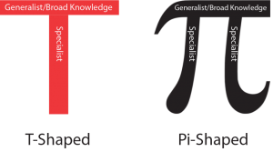
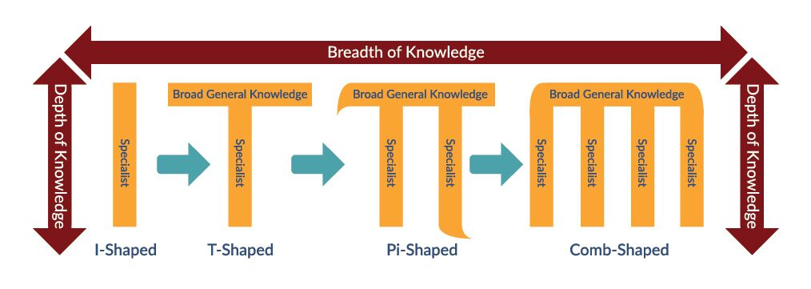
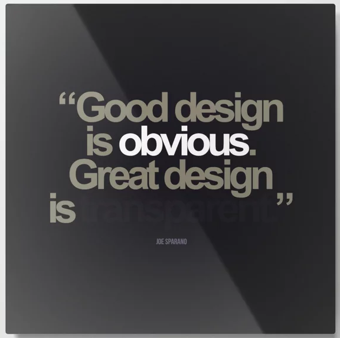

# Мозговой штурм: Развитие Tver.IO

<!-- markdownlint-disable -->
| Цель         | Настроить процессы / найти людей / уточнить позиционирование / ценности / видение, а также провести ревью и систематизировать деятельность сообщества |
| ------------ | ----------------------------------------------------------------------------------------------------------------------------------------------------- |
| Участники    | @Ilya L @Jonny N                                                                                                                                      |
| Похожие темы | - +🕘 Конспект собрания: Tver.io — Social Media Strategy                                                                                              |
<!-- markdownlint-enable -->

## Review по социальным сеткам

* Мотивация
  + Какая она? Можно с ней что-то сделать? Надо?
* Реакции в соц. сетях после последней встречи
  + Что изменилось?
    - Реакций столько же, пост стандартный
    - Интаграм поста не было
* Проблемы с соц-сетями
  + Редкие и не регулярные посты
    - Решили вопрос?
* Что можно сделать с соц-сетями
  + посты можно улучшить, попробовав написать несколько теплых слов о спикере.
    Сейчас просто копирование био и название доклада идет.
  + Можно делать такой пост в соц-сетях, которыми пользуется спикер.
    С упоминанием через @, чтобы спикер сделал репост у себя.

## Источники вдохновения

### Конференции

[NDC](https://ndcoslo.com/)

Даже конференции такого размера оказывается можно сделать согласованного и
почти без подготовки (было 10-летие события) активистов если понятные цености и
все четко - это дало толчок для того, чтобы иначе оценивать изменения в
локальном сообществе и ставить под сомнение то, что ранее считалось де-факто.

Задача была и остается - команда с понятными коммуникациями без стресса.
Но также ясно понимать, что сообщество - это не конференция, это люди для людей.

### Тестирование гипотез

Можно завести отдельный документ / таблицу с тем,
чтобы выписывать все идеи, которые превращать в гипотезы,
которые проверять на аудитории на очередном митапе

### "Почему я в сообществе?"

* Хочу пиццы и общения
* Хочу быть круче!
* …
* Я хочу быть активистом (<1%)

### Уникальные штуки

Unicorn Community

Сообщество с общим профилем - аудитории неплохо бы знать зачем ходить,
скажем, слушать доклады совершенно на разные темы.

Можно добавить темы дизайна и коммуникации,
НО после того, как сформируем фундаментальную и целостную картинку сообщества.

Для этого развивать себя в первую очередь,
чтобы быть TVER.IO SHAPED CONTRIBUTOR:

* развивать ширину знаний, умений
* развивать глубину (уровень) навыков

А для этого мы пробуем развивать уникальные направления общего профиля:

* Школа спикеров внутри сообщества #inspire
* Разговорный клуб английского языка #itd
* …
* ПРОДОЛЖАТЬ ЗАПУСКАТЬ ИНТЕНСИВЫ! Темы:
  + Сжатые лекции, прочитанные в других местах (ВУЗы и т.д)
    Ценность - доступ к уникальному контенту.

Своим примером показывать то, что это полезно!

## Идеи

* Презентация сообщества
  + Для аудитории - первая версия - для Питера
  + Выполнить в общем стиле
* Roadmap - мысли от @Ilya L + редакция @Jonny N :
  + у нас плохо с идеями на techtrain,
    потому что мы несмотря на весь рост не предложили ничего нового
    в контексте федеральном, если так можно сказать.
  + То что мы научились привлекать крутых спикера -
    это круто для небольшого города, но в большем масштабе это не выглядит крутым,
    потому что в этом нет ничего уникального -
    те же самые спикеры выступают много где.
  + Еще есть пока вещи, которые можно сделать из серии
    “такого еще в Твери никто не делал”, например, провести митап по дизайну
  + Прорабатываем на каждом Review (не реже раз в месяц) наши уникальные фишки и
    что мы нового приносим в более глобальном контексте.
    - Определить контекст, в котором мы работает
    - Переходим в формат “такого в России пока еще никто не делал” -
      встречайте пионеров будущего!
* [Шаблон документа в GDocs](https://go.tver.io/roadmap)
  + Формат и цвета, чтобы различать один от другого
    - Шапка
    - Футер (Shorthands)
  + Использовать для всех документов, в т.ч. для существующих
* Социальные сети
  + Роботизировать соц-сети
    - Генерация постов с последующим помещением в запланированные
* “Концептуальные” митапы
  + Как вариант - пробовать новый формат встреч раз в … недель
* Можно что-то вроде истории успеха людей в сообществе сделать 😉 + мини-интервью
  + Как мне помогло сообщество?
  + Почему мне нравится делать то, что я делаю?
* Документы сообщества - полностью открыть
  + Пример - [хэндбук ГитЛаб](https://about.gitlab.com/handbook/)
  + Может быть перейти на маркдаун
  + [tc39](https://github.com/tc39)

## Пути развития, установка целей

* Сделать то, что не делали сообщества в России
* Предложить что-то новое на федеральном уровне?
  + Сможем / успеем ли предложить что-то на techtrain?
  + TechTrain это повод сесть и подумать

## Формирование “фишки" (ценности / …)

* В чем мы видим фишку сейчас?
  + …
  
----------

## Следующие шаги

[ ] Начать с roadmap
[ ] Составить список альтернативных форматов митапов
[ ] Сделать фото/медийную историю
    [ ] Отдельно сделать альбомы с @Ilya L и @Jonny N ака
        “Ivan Novikov on Tver.IO (taken on meetup)”
    [ ] Профиль для rockstar-активистов на сайте tver.io в
        разделе Leadersboard (абстрактно) - для примера:
        [пример](https://news.microsoft.com/exec/satya-nadella/)
    [ ] Дать понять, что для того, чтобы что-то произошло, нужно что-то делать
        [ ] Доставить сообщение (пост?) о том, как что-то происходит,
            например, митап или тот же поход в фотостудию, ретроспектива в кафе

Когда мы делаем очередной шаг, можно задавать себе (друг другу) вопросы:

* Как это улучшает работу сообщества?
* …

Понятная и прозрачная работа сообщества

Design is “… not just what it looks like and feels like. Design is how it works.”

