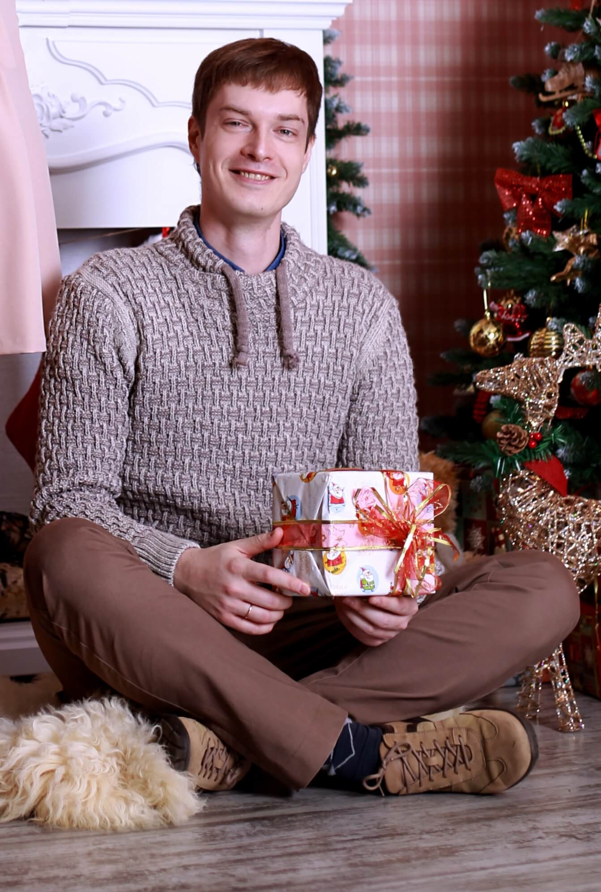

# Николай Кальгин

[github](https://github.com/kalginnick)

Разработчик, спикер

## Доклады

<!-- markdownlint-disable -->
- [ETL-pipeline из Go и лямбдок в облаке](https://github.com/kalginnick/go-lambda-talk/blob/master/slides.pdf) на [Tver.io Polyglot Meetup](https://www.meetup.com/tverio/events/257579439/)
<!-- markdownlint-enable -->
